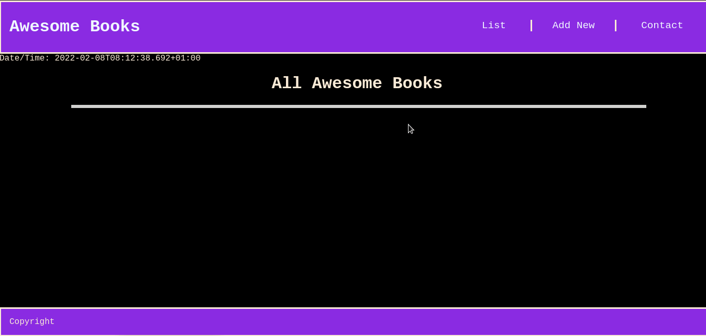

## Awesome Books

This is an e-library showing
our understanding of CRUD.

# 
<a href="https://fobadara.github.io/awesome-books/" text="bold">Live Demo</a>

# Description

> This is a site in which you can add, remove and display books. It also saves the details on local storage for use at any point in time.

# Built With :hammer:

● HTML

● CSS

● Javascript

# Technologies used:

● Linters

● Github

● Vscode

# Getting Started

To get a local copy up and running follow these simple example steps.

⬜ clone the app by running this command `git clone https://github.com/fobadara/awesomebooks.git`

⬜ Run this command `cd awesome-books`

⬜ Open in browser

# Prerequisites

You will be needing:

⬜ A web browser to view output

⬜ A text editor or terminal

# Run tests

You can run tests by following these steps:

⬜ commit and push your changes

⬜ navigate to pull request

⬜ I have created a pull request which runs linters or you could simply create a pull rrequest of your own

# Authors

👤 Kingsley

Github: [github.com/kingstalux](github.com/kingstalux)

👤 Abdulfatai Badara

GitHub: [github.com/fobadara](github.com/fobadara)

Twitter: fob90s@twitter.com

# 🤝 Contributing

Contributions, issues, and feature requests are welcome!

Feel free to check the issues page.

# Show your support

Give a ⭐️ if you like this project!

# Acknowledgments

Hat tip to anyone whose code was used

# 📝 License

This project is licensed by [MIT](LICENSE)
